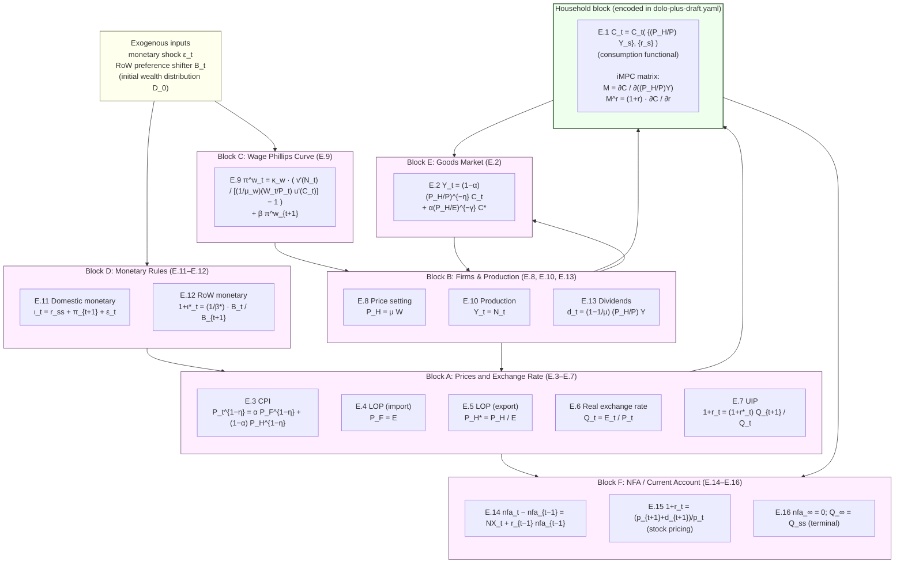

# OpenHA Perch Graphs (Household + Aggregate Blocks)

> Asset-layer artifact for the *Formalized*-tier OpenHA ballpark entry. Mermaid perch-graph diagrams for both blocks of the baseline model, per the assignment description ([Ask AI help to formalize and finalize your ballpark item](https://llorracc.github.io/workspace-course-topics/assignments/ask-ai-help-to-formalize-and-finalize-ballpark.html)) and the instructor review of [PR #73](https://github.com/econ-ark/ballpark/pull/73#issuecomment-4330234302) ("Required for Formalized approval", item 4).

The diagrams are embedded as fenced ` ```mermaid ` blocks inside this `.md` file rather than as separate `.mmd` files because the upstream `*.mmd` gitignore rule (PR #84) would otherwise ignore them. GitHub renders the mermaid blocks inline; the syntax is identical to that of standalone `.mmd` files.

For the formal Bellman statement and equation-by-equation derivation that these diagrams visualize, read [`bellman-excerpt.md`](bellman-excerpt.md) — the household block is in §8 (encoded in [`dolo-plus-draft.yaml`](dolo-plus-draft.yaml)); the aggregate block is in §§3, 7 (specified but not yet in YAML — see §13.1 for the deliberate scope choice and the follow-up plan).

---

## 1. Household block — three-stage period (encoded in YAML)

The household block of paper §2 (canonical-form Bellman, eq. (9)) is decomposed into three stages following the SolvingMicroDSOPs perch convention: each stage has an arrival perch (`<`), a decision perch (bare), and a continuation perch (`>`). This is the decomposition encoded in `dolo-plus-draft.yaml` (`horizon: infinite-stationary`).

```mermaid
flowchart LR
    %% Stage 1 — shocks (Markov draw, no decision)
    subgraph S1["Stage 1: shocks (no choice)"]
        direction LR
        S1A["arrival&lt;<br/>(a_p, e)"]
        S1D["decision<br/>(a_p, e)"]
        S1C["continuation&gt;<br/>(m_check, e')"]
        S1A -- "E_e'|e[ V&gt;(m_check, e') ]" --> S1D
        S1D -- "identity passthrough" --> S1C
    end

    %% Within-period identity rename m_check -> m
    S1C -- "identity rename<br/>m_check ↔ m" --> S2A

    %% Stage 2 — cons-noshocks (consumption choice with EGM channel)
    subgraph S2["Stage 2: cons (max c)"]
        direction LR
        S2A["arrival&lt;<br/>(m, e)"]
        S2D["decision<br/>max_c { u(c) − v(N) + V&gt;(ψ) }<br/>s.t. ψ = m − c, ψ ≥ a_bar"]
        S2C["continuation&gt;<br/>(ψ, e_out)"]
        S2A -- "identity (no shocks at this stage)" --> S2D
        S2D -- "ψ = m − c<br/>(EGM: c&gt;(ψ) = (V'&gt;(ψ))^(−1/σ))" --> S2C
    end

    S2C --> S3A

    %% Stage 3 — disc (discount-factor scaling)
    subgraph S3["Stage 3: disc (β-scaling)"]
        direction LR
        S3A["arrival&lt;<br/>(ψ, e)"]
        S3D["decision<br/>V = β · V&gt;"]
        S3C["continuation&gt;<br/>(ψ_out, e_out)"]
        S3A -- "identity" --> S3D
        S3D -- "identity" --> S3C
    end

    %% Between-period connector (twister)
    S3C -. "twister:<br/>a_p[+1] = (1+r) · ψ_out<br/>e[+1] = e_out" .-> Loop["next period:<br/>Stage 1 arrival<br/>(a_p[+1], e[+1])"]
    Loop --> S1A

    %% Styling
    classDef stage fill:#eef,stroke:#446,stroke-width:1px;
    classDef perch fill:#fff,stroke:#666,stroke-width:1px;
    class S1,S2,S3 stage;
    class S1A,S1D,S1C,S2A,S2D,S2C,S3A,S3D,S3C perch;
```



**Reading the diagram.**

- **Period composition:** `[shocks, cons, disc]` — applied in that order within each period.
- **Effective control:** `c` alone (not `(c, a')`), since the budget identity `ψ = m − c` pins down savings once `c` is chosen.
- **EGM compatibility:** the `cons` stage exposes the standard endogenous-grid channel via `c>(ψ) = (V'>(ψ))^(−1/σ)` (CRRA utility + additively separable budget make EGM apply directly; the labour-disutility term `v(N)` does not depend on `c` because hours `N` are union-set).
- **Markov shock placement:** `e` is realised at the **arrival perch of `shocks`** (not between periods, not inside the consumption decision); the cons stage receives a continuation value with shocks already integrated out.
- **Returns placement:** the `(1+r)` factor lives in the **between-period connector** (twister), not inside any stage's income formula. This corresponds to the paper's distinction between `a^p_{t+1} = (1+r_t) · ψ_t` (beginning-of-period assets including returns) and `ψ_t = m_t − c_t` (end-of-period savings).

For the explicit symbol table, perch table per stage, and the FOC / InvEuler / envelope derivations, see [`bellman-excerpt.md`](bellman-excerpt.md) §8.

---

## 2. Aggregate block — 16-equation system (specified but NOT yet in YAML)

The aggregate / general-equilibrium closure of paper §§3–4 is consolidated in `bellman-excerpt.md` §7 as a 16-equation system. The diagram below shows the natural block-grouping, the data-flow between blocks, and the household-block interface (`r`, `w`, `N` flow in; `C_t` flows out via the iMPC matrix `M`).

This block is **deliberately not encoded in YAML in this PR** — see [`bellman-excerpt.md`](bellman-excerpt.md) §13.1 for the rationale and the explicit follow-up plan for an `aggregate-draft.yaml`. The diagram below is the visualization of *what that follow-up YAML would need to encode*.



**Reading the diagram.**

- **Six blocks** group the 16 sequence-space equations of `bellman-excerpt.md` §7 by structural role: prices/exchange-rate identities (A); firm/production/dividends (B); wage Phillips curve (C); monetary rules (D); goods market clearing — the international Keynesian cross (E); NFA / current account / terminal conditions (F). The household block (`HH`) is the seventh block, already encoded in YAML.
- **Household ↔ Aggregate interface.** The household block consumes `(r, w, N)` from the aggregate block (Blocks A and B) and produces aggregate consumption `C_t` (and, around the steady state, the iMPC matrices `M` and `M^r`) into goods-market clearing (Block E) and into the NFA / current account block (F). This data-flow is the wiring contract that the follow-up `aggregate-draft.yaml` must implement.
- **Where the headline analytical results live.** The international Keynesian cross — `dC = −(α/(1−α)) M dQ + M dY`, `dY = (α/(1−α)) χ dQ − α M dQ + (1−α) M dY` — is the linearised reduction of Blocks A + B + E around the stochastic steady state, with Block C closing the wage-inflation channel. The `χ = 1` neutrality result (paper Proposition 5) is the special case where the expenditure-switching and real-income channels cancel in Block E.
- **Sequence-space-Jacobian compatibility.** This block-decomposition is structurally compatible with the SSJ apparatus of [Auclert, Bardóczy, Rognlie, Straub (2021)](https://doi.org/10.3982/ECTA17434): each block is a sequence-space-to-sequence-space map, and the GE solution is the fixed point of the composed map. The household block exposes `M` and `M^r` directly; the aggregate block contributes the `χ`-and-`α`-dependent kernels of Blocks A, B, E. The follow-up `aggregate-draft.yaml` would supply the SSJ-side kernels; HARK's existing incomplete-markets consumption block would supply the household-side `M`, `M^r`.

For the explicit equations, see `bellman-excerpt.md` §§3 (block-by-block derivation), §5 (iMPC apparatus), §6 (analytical shock-response results), and §7 (consolidated 16-equation system).
