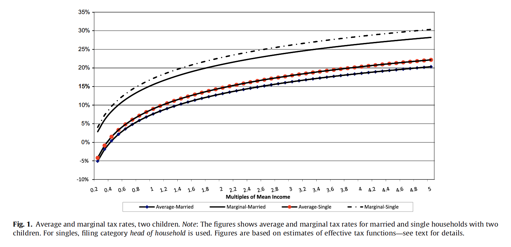
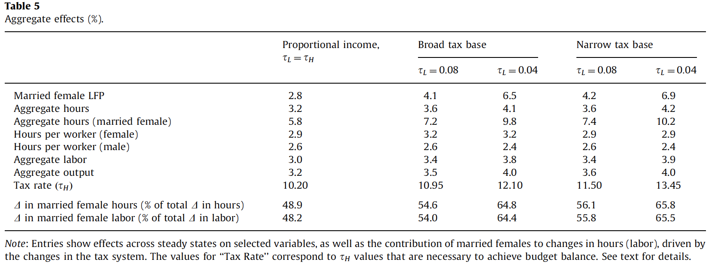

---
jupytext:
  text_representation:
    extension: .md
    format_name: myst
    format_version: 0.13
    jupytext_version: 1.19.1
kernelspec:
  display_name: Python 3
  language: python
  name: python3
---

+++ {"slideshow": {"slide_type": "slide"}}

<b>
Taxing Women: A Macroeconomic Analysis
</b>
  
<b>
Author: Nezih Guner, Remzi Kaygusuz and Gustavo Ventura
</b>
<b>
Journal of Monetary Economics 59 (2012)
</b>
  
<b>
Slides by: Syareza Tobing (Ray)

     <b>
February 2021
</b> 

+++ {"slideshow": {"slide_type": "slide"}}

# I. Summary

* The paper evaluates the implications of taxing women at lower rates than men

   

+++ {"slideshow": {"slide_type": "subslide"}}

* The model considers households that periodically makes labor supply, consumption and saving decisions

+++ {"slideshow": {"slide_type": "fragment"}}

* Individuals differ in terms of their labor efficiency unit

+++ {"slideshow": {"slide_type": "subslide"}}

 

* A proportional tax rate on married females equal to 4% increases output and labor force participation by 4% and 6.9% respectively

+++ {"slideshow": {"slide_type": "fragment"}}

* Welfare gains are even higher when the US tax system is replace by a proportional, gender netural income tax

+++ {"slideshow": {"slide_type": "slide"}}

# II. The Model

### A stationary overlapping generations economy with a continuum of males and females

+++ {"slideshow": {"slide_type": "fragment"}}

* Heterogeneity in gender and marital status (all stationary)
* Men always work but women enter and exit the workforce
* Married households and single females differ in the number of (no utility giving but costly) children 

+++ {"slideshow": {"slide_type": "fragment"}}

* Starts life as workers and work until a certain age before dying at a later age
* Households periodically makes labor supply, consumption and saving decisions
* Females who aren't working experience losses of labor efficiency units

+++ {"slideshow": {"slide_type": "subslide"}}

Three bellman equations :

1. Single Male
2. Single Female
3. Married households

+++ {"slideshow": {"slide_type": "subslide"}}

### 1. Single Male

$
V_{m}^{S}(a, z, j)=\max _{a^{\prime}, l}\left\{U_{m}^{S}(c, l)+\beta V_{m}^{S}\left(a^{\prime}, z, j+1\right)\right\}
$

subject to

$
c+a^{\prime}=\left\{\begin{array}{ll}
a\left(1+r\left(1-\tau_{k}\right)\right)+w \varpi_{m}(z, j) l\left(1-\tau_{p}\right) & \text { if } j<J_{R} \\
a\left(1+r\left(1-\tau_{k}\right)\right)+p_{m}^{S}(z)-T^{S}(r a) & \text {otherwise}
\end{array}\right.
$

and

$l \geq 0, \quad a^{\prime} \geq 0 \quad$ (with strict equality if $j=J$ )

+++ {"slideshow": {"slide_type": "subslide"}}

### 2. Single Female

$
V_{f}^{S}(a, h, x, b, j)=\max _{a^{\prime}, l}\left\{U_{f}^{S}\left(c, l, k_{y}\right)+\beta V_{f}^{S}\left(a^{\prime}, h^{\prime}, x, b, j+1\right)\right\}
$

subject to

(i) With kids: if $b=\{1,2\}, j \in\{b, b+1, b+2\},$ then $k=1,$ and
$
c+a^{\prime}=a\left(1+r\left(1-\tau_{k}\right)\right)+w h l\left(1-\tau_{p}\right)-T^{S}(w h l+r a, 1)-w d(j+1-b) \chi(l)
$

(ii) Without kids but not retired: 
$
\text {if} \ b=0, \text { or } b=\{1,2\} \text { and } b+2<j<J_{R}, \text { or } b=2 \text { and } j=1, \text { then } k=0 \text { and }\\
c+a^{\prime}=a\left(1+r\left(1-\tau_{k}\right)\right)+w h l\left(1-\tau_{p}\right)-T^{S}(w h l+r a, 0)
$

(iii) Retired: 
$
\text {if} \ j \geq J_{R}, k=0 \text { and }\\
c+a^{\prime}=a\left(1+r\left(1-\tau_{k}\right)\right)+p_{f}^{S}(x)-T^{S}(r a, 0)
$

+++ {"slideshow": {"slide_type": "subslide"}}

### 3. Married Households (A)

$
V^{M}(a, h, x, z, q, b, j)=\max _{a^{\prime}, l_{f}, l_{m}}\left\{\left[U_{f}^{M}\left(c, l_{f}, q, k_{y}\right)+U_{m}^{M}\left(c, l_{m}, l_{f}, q\right)\right]+\beta V^{M}\left(a^{\prime}, h^{\prime}, x, z, q, b, j+1\right)\right\}
$

(i) With kids: if $b=\{1,2\}, j \in\{b, b+1, b+2\},$ then $k=1$ and
$
c+a^{\prime}=a\left(1+r\left(1-\tau_{k}\right)\right)+w\left(\varpi_{m}(z, j) l_{m}+h l_{f}\right)\left(1-\tau_{p}\right)-T^{M}\left(w \varpi_{m}(z, j) l_{m}+w h l_{f}+r a, 1\right)-w d(j+1-b) \chi\left(l_{f}\right)
$

Furthermore, if $b=j,$ then $k_{y}=1$

+++ {"slideshow": {"slide_type": "subslide"}}

### 3. Married Households (B)

$
V^{M}(a, h, x, z, q, b, j)=\max _{a^{\prime}, l_{f}, l_{m}}\left\{\left[U_{f}^{M}\left(c, l_{f}, q, k_{y}\right)+U_{m}^{M}\left(c, l_{m}, l_{f}, q\right)\right]+\beta V^{M}\left(a^{\prime}, h^{\prime}, x, z, q, b, j+1\right)\right\}
$

(ii) Without kids but not retired: if $b=0$, or $b=\{1,2\}$ and $b+2<j<J_{R}$, or $b=2, j=1,$ then $k=0$ and
$c+a^{\prime}=a\left(1+r\left(1-\tau_{k}\right)\right)+w\left(\varpi_{m}(z, j) l_{m}+h l_{f}\right)\left(1-\tau_{p}\right)-T^{M}\left(w \varpi_{m}(z, j) l_{m}+w h l_{f}+r a, 0\right)$

(ii) Retired: if $j \geq J_{R},$ then $k=0$ and
$c+a^{\prime}=a\left(1+r\left(1-\tau_{k}\right)\right)+p^{M}(x, z)-T^{M}(r a, 0)$

In addition,

$
h^{\prime}=G\left(x, h, l_{f}, j\right)
$

$l_{m} \geq 0, \quad l_{f} \geq 0, a^{\prime} \geq 0$ (with strict equality if $\left.j=J\right)$.

+++ {"slideshow": {"slide_type": "slide"}}

# III Method of Computation

* Authors compute the transitions between steady states to find welfare standings for individuals alive at the date when the tax system is changed
* Constructs the distribution of households over different states using forward iteration.

+++ {"slideshow": {"slide_type": "notes"}}

Link to original paper and replication code
* [Guner et al.](https://www.sciencedirect.com/science/article/pii/S0304393211001036)
